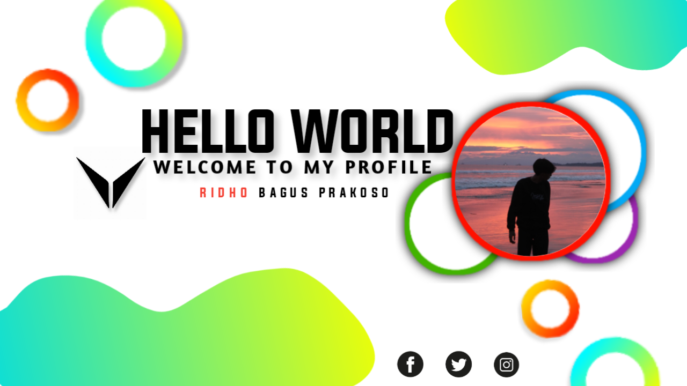

<!--Banner-->

<!--Night Owl image-->

  

<!--Header Name-->
#  Im Ridho Bagus 
*Digital Craftsman (Developer / Programmer)*
  

<!--Start Intro-->               

I am a Front-End Developer and Machine Learning Enthusiast with a huge love for React.js, NextJS, JavaScript, HTML, CSS, C++, and Data Visualization. 

- ✨ Student of life :)
- 🌱 I’m currently learning many things, I believe that everyday is a learning opportunity.
- 💁‍♂️ Trusted Store VPS/RDP at [Group WhatsApp](https://chat.whatsapp.com/CWZEagHQsgK3pbGyzjC8PV)
- 🏙 Testimoni Sakuran WhatsApp at [Saluran WhatsApp](https://whatsapp.com/channel/0029VaZM1OwAu3aQna7Wy31f).
- ❤ Contributing to Open Source.
- 💻 Visit my [Store](https://www.dolphinbyte.xyz/) for more details about me.
<!--End Intro-->

<!--Profile Count Badge-->

  

---

<!--Languages and Tools Section-->       
<h2 align="center">Tᴇᴄʜ sᴛᴀᴄᴋ & Lᴀᴛᴇsᴛ ʙʟᴏɢs</h2> 
<picture>
  <source media="(prefers-color-scheme: dark)" srcset="./Skills_Animation_Dark.gif">
  <source media="(prefers-color-scheme: light)" srcset="./Skills_Animation_White.gif">
  
</picture>
 

<h3 align="left">Current Learning</h3>
<ul align="left">
  <li>Deepening my knowledge in Machine Learning and AI.</li>
  <li>Exploring advanced React.js patterns and state management techniques.</li>
  <li>Improving my skills in cloud computing with Azure and DigitalOcean.</li>
</ul>
 

<!--Contribution Graph-->
<h2 align="center">📈 Cᴏɴᴛʀɪʙᴜᴛɪᴏɴ Gʀᴀᴘʜ 📈</h2>

    

---

<!--Dynamic Quote card updates everyday at 12 PM--> 
<h2 align="center">🌟 Tʜᴏᴜɢʜᴛ ᴏғ ᴛʜᴇ Dᴀʏ 🌟</h2>

<!--STARTS_HERE_QUOTE_CARD-->

    

<!--ENDS_HERE_QUOTE_CARD-->

<!--Contact Section--> 

<h2 align="center">🤝 Cᴏɴɴᴇᴄᴛ Wɪᴛʜ Mᴇ 🤝 </h2>

  

 

<!--Buy me a coffee-->

<!--Footer--> 

  

